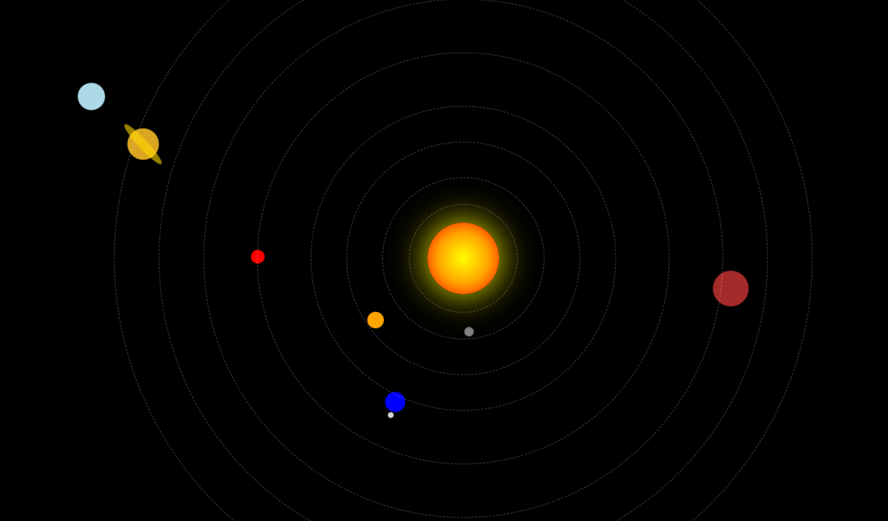

🌌 3D Solar System Animation

A visually engaging Solar System built using HTML and CSS. This project demonstrates CSS animations, orbital motion, positioning, and creative frontend design without relying on JavaScript.

✨ Features

- ☀️ Animated Sun and planets
- 🪐 Smooth orbital motion
- 🎨 Pure HTML & CSS
- 📱 Responsive design
- ⚡ Lightweight and beginner-friendly

🛠️ Technologies Used

- HTML
- CSS (Animations, Transforms & Keyframes)

🚀Live Demo
 https://priyatopriya3103-bot.github.io/Solar-System/

📷 Preview

📚 What I Learned

- CSS Keyframes
- Positioning and Transformations
- Animation Timing
- Creative UI Design

💡 Future Improvements

- Planet information popup
- Speed controls
- Dark themes

---

⭐ If you enjoyed this project, consider giving it a star!